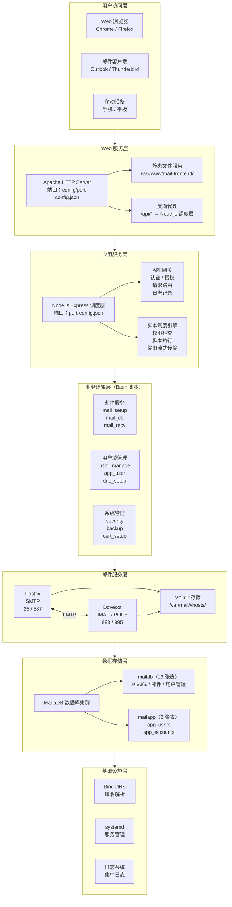

# XM邮件管理系统 V5.0.2

## 项目概述

本项目在 Rocky Linux 9 上构建 Postfix + Dovecot 的企业级邮件服务，前端使用 Vue 3 现代化界面设计，后端以受控 Bash 脚本为核心，通过最小化 HTTP 调度层提供 API，统一由 Apache 托管与反向代理。支持虚拟域/用户（MariaDB）、共享邮箱、证书自动化、垃圾/病毒过滤、监控与日志集中、备份与灾备。系统采用专用的 `xm` 管理员用户运行调度层服务，确保安全性和权限控制。界面采用玻璃拟态设计风格，配备流畅的动画效果和响应式布局，提供现代化的用户体验。

### 🎊 V5.0.2 版本更新（2026-02-03）

**📌 最新更新**：
- **HTTP 跳转状态识别**：后端 http-redirect-status 增加 parseHttpRedirectConfig、sudo 回退读取 _http.conf、mailmgmt/mail-ops 跳转块检测，按钮能正确识别已配置/未配置
- **邮件页统计与草稿箱**：主内容区各邮箱标题旁「共 N 封」；侧栏仅收件箱未读角标；草稿箱/已删除列表按 id 去重避免合并；mail_db.sh 草稿箱（folder_id=3）按发件人校验权限；草稿列表点击卡片直接进入编辑

> 查看完整更新明细与历史版本，请参见更新指南文档：[UPDATE_GUIDE.md](./UPDATE_GUIDE.md)


## 系统架构

### 整体架构图

#### ASCII 架构图

```
┌──────────────────────────────────────────────────────────────────────┐
│                              用户访问层                               │
│                                                                      │
│  ┌────────────┐      ┌────────────┐      ┌────────────┐            │
│  │ Web 浏览器  │      │ 邮件客户端  │      │ 移动设备    │            │
│  │ Chrome     │      │ Outlook     │      │ 手机 / 平板 │            │
│  │ Firefox    │      │ Thunderbird │      │             │            │
│  └─────┬──────┘      └─────┬──────┘      └─────┬──────┘            │
└────────┼───────────────────┼───────────────────┼────────────────────┘
         │                   │                   │
         ▼                   ▼                   ▼
┌──────────────────────────────────────────────────────────────────────┐
│                              Web 服务层                               │
│                                                                      │
│  ┌────────────────────────────────────────────────────────────────┐  │
│  │ Apache HTTP Server (端口从 config/port-config.json 读取)        │  │
│  │                                                                │  │
│  │  ┌─────────────────┐        ┌─────────────────────────────┐ │  │
│  │  │ 静态文件服务     │        │ 反向代理（API 转发）         │ │  │
│  │  │ /var/www/        │        │ /api/* → Node.js 调度层      │ │  │
│  │  │ mail-frontend/   │        │（端口从 port-config 读取）  │ │  │
│  │  └─────────────────┘        └─────────────────────────────┘ │  │
│  └────────────────────────────────────────────────────────────────┘  │
└──────────────────────────────┬───────────────────────────────────────┘
                               │
                               ▼
┌──────────────────────────────────────────────────────────────────────┐
│                              应用服务层                               │
│                                                                      │
│  ┌────────────────────────────────────────────────────────────────┐  │
│  │ Node.js Express 调度层（端口从 port-config.json 读取）          │  │
│  │                                                                │  │
│  │  ┌─────────────────┐        ┌─────────────────────────────┐ │  │
│  │  │ API 网关         │        │ 脚本调度引擎                │ │  │
│  │  │ - 认证 / 授权    │        │ - 权限检查                  │ │  │
│  │  │ - 请求路由       │        │ - 脚本执行                  │ │  │
│  │  │ - 日志记录       │        │ - 输出流式传输              │ │  │
│  │  └─────────────────┘        └─────────────────────────────┘ │  │
│  └──────────────────────────────┬───────────────────────────────┘  │
└──────────────────────────────────┼──────────────────────────────────┘
                                   │
                                   ▼
┌──────────────────────────────────────────────────────────────────────┐
│                       业务逻辑层（Bash 脚本）                          │
│                                                                      │
│  ┌────────────┐      ┌────────────┐      ┌────────────┐            │
│  │ 邮件服务   │      │ 用户域管理  │      │ 系统管理   │            │
│  │ mail_setup │      │ user_manage │      │ security   │            │
│  │ mail_db    │      │ app_user    │      │ backup     │            │
│  │ mail_recv  │      │ dns_setup  │      │ cert_setup │            │
│  └─────┬──────┘      └─────┬──────┘      └─────┬──────┘            │
└────────┼───────────────────┼───────────────────┼────────────────────┘
         │                   │                   │
         ▼                   ▼                   ▼
┌──────────────────────────────────────────────────────────────────────┐
│                              邮件服务层                               │
│                                                                      │
│  ┌────────────┐                           ┌────────────┐           │
│  │ Postfix    │◄────────── LMTP ─────────►│ Dovecot    │           │
│  │ SMTP       │                           │ IMAP/POP3 │           │
│  │ 25 / 587   │                           │ 993 / 995 │           │
│  └─────┬──────┘                           └─────┬──────┘           │
│        │                                         │                 │
│        └──────────────────┬─────────────────────┘                 │
│                           ▼                                       │
│        ┌────────────────────────────────────────┐                 │
│        │ Maildir 存储 /var/mail/vhosts/          │                 │
│        └────────────────────────────────────────┘                 │
└──────────────────────────────┬──────────────────────────────────────┘
                               │
                               ▼
┌──────────────────────────────────────────────────────────────────────┐
│                              数据存储层                               │
│                                                                      │
│  ┌────────────────────────────────────────────────────────────────┐  │
│  │ MariaDB 数据库集群                                              │  │
│  │                                                                │  │
│  │  ┌───────────────────┐        ┌───────────────────┐           │  │
│  │  │ maildb（13 张表）  │        │ mailapp（2 张表）  │           │  │
│  │  │ Postfix / 邮件 /   │        │ app_users         │           │  │
│  │  │ 用户管理表         │        │ app_accounts      │           │  │
│  │  └───────────────────┘        └───────────────────┘           │  │
│  └────────────────────────────────────────────────────────────────┘  │
└──────────────────────────────┬──────────────────────────────────────┘
                               │
                               ▼
┌──────────────────────────────────────────────────────────────────────┐
│                              基础设施层                               │
│                                                                      │
│  ┌────────────┐      ┌────────────┐      ┌────────────┐            │
│  │ Bind DNS   │      │ systemd     │      │ 日志系统   │            │
│  │ 域名解析   │      │ 服务管理    │      │ 集中日志   │            │
│  └────────────┘      └────────────┘      └────────────┘            │
└──────────────────────────────────────────────────────────────────────┘
```

#### Mermaid 架构图（Flowchart）:



### 架构说明

**分层架构设计**：

- **用户访问层**：支持Web浏览器、邮件客户端和移动设备访问
- **Web服务层**：Apache提供静态文件服务和API反向代理
- **应用服务层**：Node.js Express调度层，统一管理脚本执行和API路由
- **业务逻辑层**：19个Bash脚本，实现各种业务功能
- **邮件服务层**：Postfix（SMTP）和Dovecot（IMAP/POP3）提供邮件收发服务
- **数据存储层**：双数据库架构（maildb 13张表 + mailapp 2张表 = 15张表）
- **基础设施层**：DNS、systemd、日志系统等基础设施服务

### 技术栈详解

#### 前端层 (Vue 3)
- **框架**: Vue 3.4.38 + TypeScript
- **构建工具**: Vite 5.4.8
- **样式**: Tailwind CSS 3.4.0
- **路由**: Vue Router 4.4.5
- **HTTP 客户端**: Axios 1.7.7
- **图标**: Heroicons Vue 2.1.1
- **图表**: Chart.js 4.4.0
- **终端**: xterm.js 5.5.0 (WebSocket终端、伪终端支持)
- **功能**: 用户管理、系统监控、日志查看、邮件管理、Web终端、版本历史
- **页面**: 登录、注册、重置密码、首页、仪表板、邮件管理、系统设置、个人资料、更新日志（共10个页面）

#### 代理层 (Apache)
- **Web 服务器**: Apache 2.4
- **反向代理**: 静态文件服务 + API 转发
- **端口配置**: 从 `config/port-config.json` 读取HTTP/HTTPS端口（默认80/443）
- **SSL/TLS**: Let's Encrypt 自动证书（仅在检测到证书时启用HTTPS）
- **模块**: rewrite, deflate, expires, headers
- **配置**: 虚拟主机 + 反向代理规则（动态端口配置）

#### 调度层 (Node.js)
- **运行时**: Node.js 20.x (v20.20.0, LTS Iron)
- **框架**: Express.js 4.19.2
- **端口配置**: 从 `config/port-config.json` 读取API端口（默认8081）
- **认证**: Basic Auth（密码从 `/etc/mail-ops/xm-admin.pass` 读取）
- **日志**: Morgan 1.10.0
- **邮件**: Nodemailer 6.9.7
- **UUID**: uuid 9.0.1
- **WebSocket**: ws 8.16.0（实时终端通信）
- **伪终端**: node-pty 1.0.0（交互式终端支持，以 euser 用户运行，无 sudo）
- **功能**: API 网关、脚本调度、日志记录、邮件发送、WebSocket 终端、验证码生成
- **安全**: sudoers 权限控制
- **运行用户**: xm（调度层专用管理员用户）
- **命令终端用户**: euser（start.sh 自动创建，无 sudo，密码存于 `/etc/mail-ops/euser.pass`，随机生成）
- **权限管理**: 智能 sudo 检测，支持无 sudo 环境降级
- **脚本执行**: 统一权限检查和立即输出反馈

#### 邮件服务层
- **SMTP**: Postfix + postfix-mysql (邮件发送)
- **IMAP/POP3**: Dovecot + dovecot-mysql (邮件接收)
- **数据库**: MariaDB (虚拟域/用户)
- **认证**: SQL 认证 + SHA512-CRYPT
- **存储**: Maildir 格式
- **虚拟邮箱**: MySQL 虚拟域支持
- **SSL/TLS**: 自签名证书支持

#### Bash脚本层（19个脚本）
- **邮件服务管理**：
  - `mail_setup.sh`：Postfix和Dovecot配置管理
  - `mail_db.sh`：邮件数据库管理（9张表，邮件CRUD、文件夹、标签等）
  - `mail_receiver.sh`：邮件接收处理
  - `mail_init.sh`：邮件系统初始化
- **用户与域管理**：
  - `user_manage.sh`：邮件用户管理（虚拟用户）
  - `app_user.sh`：应用用户管理（Web登录用户，2张表）
  - `db_setup.sh`：数据库初始化（Postfix虚拟用户表，4张表）
- **DNS与证书**：
  - `dns_setup.sh`：DNS配置（Bind DNS/公网DNS）
  - `cert_setup.sh`：SSL证书管理（Let's Encrypt/自签名）
- **系统管理**：
  - `security.sh`：安全配置（防火墙、SELinux、密码策略）
  - `backup.sh`：备份与恢复（数据库、配置、邮件数据）
  - `dispatcher.sh`：调度层服务管理
  - `update_repos.sh`：仓库源更新（阿里云镜像）
- **日志系统**：
  - `log_viewer.sh`：系统日志查看
  - `mail_logger.sh`：邮件操作日志记录
  - `mail_log_viewer.sh`：邮件日志查看
  - `mail_service_logger.sh`：邮件服务日志集成
- **垃圾邮件过滤**：
  - `spam_filter.sh`：垃圾邮件过滤配置（数据库存储）
  - `test_spam_filter.sh`：垃圾邮件过滤测试
- **功能特性**：
  - 统一工作目录管理（避免getcwd错误）
  - 统一权限检查机制（require_root函数）
  - 统一错误处理和日志记录
  - 统一密码读取（从密码文件读取）
  - 数据库密码随机生成和安全存储

#### 系统层 (Rocky Linux 9)
- **操作系统**: Rocky Linux 9.x
- **包管理**: dnf
- **服务管理**: systemd
- **防火墙**: firewalld (可选)
- **安全**: SELinux (permissive 模式)
- **管理员用户**: xm（专用管理员，完整 sudo 权限）
- **命令终端用户**: euser（无 sudo，密码 `/etc/mail-ops/euser.pass` 随机生成）
- **用户管理**: 智能用户创建/提权机制
- **DNS 服务**: Bind DNS（本地解析）
- **邮件服务**: Postfix + Dovecot + MySQL 支持

## 目录结构

```
bash/                                    # 项目根目录
├── backend/                             # 后端核心目录
│   ├── apache/                          # Apache 配置目录
│   │   ├── httpd-vhost.conf             # 虚拟主机配置 (静态文件服务+API反向代理)
│   │   ├── sudoers.d/                   # sudo 权限配置目录
│   │   │   └── mailops                  # 邮件系统权限配置 (xm 用户 sudo 权限)
│   │   └── systemd/                     # systemd 服务配置目录
│   │       └── mail-ops-dispatcher.service  # 调度层服务单元 (mail-ops-dispatcher)
│   │
│   ├── dispatcher/                      # Node.js 调度层
│   │   ├── package.json                 # 依赖配置 (Express, Nodemailer, UUID, Morgan, ws, node-pty, multer)
│   │   └── server.js                    # API 服务器 (端口从 port-config.json 读取，默认 8081)
│   │
│   └── scripts/                        # Bash 脚本集合 (19 个脚本)
│       ├── app_user.sh                  # 应用用户管理 (Web 登录用户，app_users/app_accounts)
│       ├── backup.sh                    # 备份与恢复 (数据库、配置、邮件数据)
│       ├── cert_setup.sh                # SSL 证书 (Let's Encrypt/自签名)
│       ├── db_setup.sh                  # 数据库初始化 (Postfix 虚拟用户表，4 张表)
│       ├── dns_setup.sh                 # DNS 配置 (Bind DNS/公网 DNS)
│       ├── dispatcher.sh                # 调度层服务管理
│       ├── log_viewer.sh                # 系统日志查看
│       ├── mail_db.sh                   # 邮件数据库管理 (9 张表，邮件 CRUD、文件夹、标签等)
│       ├── mail_init.sh                 # 邮件系统初始化
│       ├── mail_log_viewer.sh           # 邮件日志查看
│       ├── mail_logger.sh               # 邮件操作日志记录
│       ├── mail_receiver.sh             # 邮件接收处理
│       ├── mail_service_logger.sh       # 邮件服务日志集成
│       ├── mail_setup.sh                # 邮件服务配置 (Postfix/Dovecot)
│       ├── security.sh                  # 安全配置 (防火墙、SELinux、密码策略)
│       ├── spam_filter.sh               # 垃圾邮件过滤配置 (数据库存储)
│       ├── test_spam_filter.sh          # 垃圾邮件过滤测试
│       ├── update_repos.sh              # 仓库源更新 (阿里云镜像)
│       └── user_manage.sh               # 邮件用户管理 (虚拟用户 CRUD)
│
├── config/                              # 项目配置文件目录
│   ├── port-config.json                 # 端口配置 (API、前端开发端口、Apache HTTP/HTTPS)
│   └── system-settings.json             # 系统设置 (常规、安全、邮件、通知、性能)
│
├── frontend/                            # Vue 3 前端目录
│   ├── src/
│   │   ├── components/                  # 公共组件
│   │   │   ├── Layout.vue               # 统一布局 (导航栏、日志查看器、用户信息)
│   │   │   └── Terminal.vue             # Web 终端 (WebSocket、伪终端 node-pty)
│   │   ├── modules/                     # 页面组件 (10 个页面)
│   │   │   ├── App.vue                  # 应用根组件
│   │   │   ├── Changelog.vue             # 更新日志 (版本历史、分页)
│   │   │   ├── Dashboard.vue            # 管理面板 (系统管理、用户管理、高级功能、图表)
│   │   │   ├── Landing.vue              # 首页 (系统介绍、快速入口)
│   │   │   ├── Login.vue                # 登录 (认证、验证码)
│   │   │   ├── Mail.vue                 # 邮件管理 (收发、文件夹、标签)
│   │   │   ├── Profile.vue              # 个人资料 (信息、密码、头像)
│   │   │   ├── Register.vue             # 注册 (验证码)
│   │   │   ├── Reset.vue                # 密码重置 (验证码)
│   │   │   └── Settings.vue             # 系统设置 (常规、通知、性能、安全)
│   │   ├── utils/
│   │   │   ├── activityTracker.ts       # 活动追踪 (会话超时)
│   │   │   ├── userLogger.ts            # 用户操作日志
│   │   │   └── versionManager.ts        # 版本号管理与同步
│   │   └── main.ts                      # 应用入口 (Vue Router、路由守卫)
│   ├── index.html                       # HTML 入口
│   ├── package.json                     # 依赖 (Vue 3, Vite, Tailwind, Vue Router, Axios, Chart.js, xterm)
│   ├── postcss.config.js                # PostCSS (Tailwind)
│   ├── tailwind.config.js               # Tailwind 主题与样式
│   ├── vite.config.ts                   # Vite 构建与开发服务器
│   └── favicon.ico                      # 网站图标
│
├── README.md                            # 项目主文档 (概述、架构、快速开始、命令参考、功能特性)
├── UPDATE_GUIDE.md                      # 更新操作指南 (版本历史、升级步骤、维护操作)
├── start.sh                             # 一键部署与管理脚本 (部署、诊断、日志、故障排除)
└── mail_CX.sh                           # 邮件系统数据库检测工具 (maildb/mailapp 检测报告)
```

### 目录说明

**后端目录 (`backend/`)**：
- **`apache/`**：Apache 虚拟主机模板（`httpd-vhost.conf`）、sudoers 模板（`sudoers.d/mailops`）、systemd 单元（`mail-ops-dispatcher.service`），部署时由 `start.sh` 替换 `${BASE_DIR}`、端口等变量
- **`dispatcher/`**：Node.js 20.x Express 调度层，提供 API 网关、脚本调度、WebSocket 终端、Basic 认证；端口与密码从 `config/port-config.json` 与 `/etc/mail-ops/xm-admin.pass` 读取
- **`scripts/`**：19 个 Bash 脚本（邮件：mail_setup/mail_db/mail_receiver/mail_init；用户与域：user_manage/app_user/db_setup；DNS/证书：dns_setup/cert_setup；系统：security/backup/dispatcher/update_repos；日志：log_viewer/mail_logger/mail_log_viewer/mail_service_logger；垃圾过滤：spam_filter/test_spam_filter）

**前端目录 (`frontend/`)**：
- **`src/components/`**：公共组件（`Layout.vue` 布局/导航/日志查看器，`Terminal.vue` Web 终端，WebSocket + node-pty）
- **`src/modules/`**：10 个页面（`App.vue`、`Landing.vue`、`Login.vue`、`Register.vue`、`Reset.vue`、`Dashboard.vue`、`Mail.vue`、`Settings.vue`、`Profile.vue`、`Changelog.vue`）
- **`src/utils/`**：工具（`activityTracker.ts` 活动追踪/会话超时、`userLogger.ts` 用户操作日志、`versionManager.ts` 版本号同步）
- **根目录**：`package.json`、`vite.config.ts`、`tailwind.config.js`、`postcss.config.js`、`index.html`、`favicon.ico`；开发端口从 `config/port-config.json` 的 `frontend.devPort` 读取（默认 5173）

**配置文件目录 (`config/`)**：
- **`port-config.json`**：端口配置（`api.port` 默认 8081、`frontend.devPort` 默认 5173、`apache.httpPort` 默认 80、`apache.httpsPort` 默认 443）；修改后需重新部署或重启相关服务生效
- **`system-settings.json`**：系统设置（`general` 系统名/管理员邮箱/时区/分页/ICP；`security` SSL/会话超时/登录限制/密码策略；`mail` 邮箱大小/垃圾过滤/分页；`notifications` 告警邮箱与阈值；`performance` 连接与缓存）

**根目录文件**：
- **`start.sh`**：一键部署与管理（`start`/`start -d`、`check`、`rebuild`、`status`、`restart`、`stop`、`restart-dispatcher`、`logs`、`mail-logs`、`fix-auth`/`fix-db`/`fix-dispatcher`、`help`）
- **`README.md`**：项目主文档（概述、架构、目录结构、快速开始、命令参考、功能特性、版本历史）
- **`UPDATE_GUIDE.md`**：更新操作指南（版本升级步骤、维护操作、故障排除）
- **`mail_CX.sh`**：邮件系统数据库检测（maildb/mailapp 连接、表结构、健康报告，输出 Markdown 报告）

## 快速开始

### 系统要求

**硬件要求**：
- **CPU**：2 核以上（推荐 4 核）
- **内存**：最小 2GB，推荐 4GB+（生产建议 8GB+）
- **磁盘**：最小 40GB，推荐 60GB+（邮件存储需额外空间）
- **网络**：公网访问（下载依赖、DNS、证书申请）

**软件要求**：
- **操作系统**：Rocky Linux 9.x（与 CentOS 8 / RHEL 8 兼容）
- **Node.js**：v20.20.0+（LTS Iron；部署时优先通过 NodeSource 安装 20.x，不可用时回退 AppStream nodejs:18）
- **权限**：root（用于首次部署）
- **网络**：可访问互联网（安装软件包与依赖）

### 默认账户信息

**Web 管理界面登录**：
- **用户名**：`xm`
- **密码**：默认 `xm666@`，首次部署时写入 `/etc/mail-ops/xm-admin.pass`；修改该文件后需重启调度层服务生效
- **权限**：超级管理员（完整系统权限）

**系统用户**：
- **管理员用户**：`xm`（Linux 用户，密码同 `/etc/mail-ops/xm-admin.pass`）
- **调度层运行用户**：`xm`（mail-ops-dispatcher 以 xm 运行，具备所需 sudo 权限）
- **命令终端用户**：`euser`（start.sh 自动创建，无 sudo；密码存于 `/etc/mail-ops/euser.pass`，首次随机生成）
- **密码文件**：`/etc/mail-ops/xm-admin.pass` 权限 640（root:xm）；`/etc/mail-ops/euser.pass` 权限 640（root:xm）

**数据库用户**：
- **mailuser**：maildb，密码随机生成，存于 `/etc/mail-ops/mail-db.pass`
- **mailappuser**：mailapp，密码随机生成，存于 `/etc/mail-ops/app-db.pass`

**端口配置**：
- 统一在 `config/port-config.json`：API 默认 8081、前端开发默认 5173、Apache HTTP/HTTPS 默认 80/443；修改后需重新部署或重启对应服务

### 界面特性

**现代化设计**：
- **玻璃拟态**：半透明背景、模糊、渐变
- **动画**：滑入、淡入、悬停、缩放等
- **响应式**：桌面、平板、移动端
- **导航**：左侧导航栏，支持折叠/展开
- **背景与状态**：渐变背景、浮动装饰、实时状态与加载动画

**用户体验**：
- **操作超时**：长时间操作 60 秒超时与 500ms 轮询反馈
- **错误与日志**：友好错误提示、用户操作审计日志
- **验证码**：登录、注册、重置密码页数学验证码
- **会话超时**：无操作 5 分钟自动退出（可配置）
- **登录安全**：IP 维度失败次数限制（5 次失败锁定 15 分钟）
- **Web 终端**：WebSocket + node-pty，多标签、交互式 shell，以 euser 用户运行（无 sudo）

### 安装步骤

#### 1. 准备系统环境

   ```bash
# 更新系统
   sudo dnf update -y
   
# 设置主机名（可选）
   sudo hostnamectl set-hostname mail.example.com

# 确保有root权限
sudo su -
   ```

#### 2. 获取项目代码

   ```bash
# 克隆项目（或上传项目文件）
   git clone <repository-url>
   cd bash

# 或直接解压项目文件
# unzip mail-system.zip
# cd bash
   ```

#### 3. 执行一键部署

   ```bash
# 赋予执行权限
chmod +x start.sh

# 执行完整部署（推荐首次使用）
   ./start.sh start
   
# 部署过程包括：
# - 自动安装Apache、Node.js、MariaDB、Postfix、Dovecot
# - 自动创建xm管理员用户和配置权限（密码存储在/etc/mail-ops/xm-admin.pass）
# - 自动初始化数据库（15张表）
# - 自动生成数据库密码文件（mail-db.pass、app-db.pass）
# - 自动读取端口配置（config/port-config.json）
# - 自动配置邮件服务
# - 自动构建和部署前端界面
# - 自动启动所有服务
   ```

#### 4. 验证部署结果

```bash
# 检查服务状态
./start.sh status

# 运行系统诊断
   ./start.sh check
   
# 查看安装日志
./start.sh logs install
```

#### 5. 访问管理界面

- **Web管理界面**: `http://your-server-ip` 或 `http://your-domain`（端口从`config/port-config.json`读取，默认80）
- **默认登录**: 用户名 `xm`，密码从 `/etc/mail-ops/xm-admin.pass` 读取（默认 `xm666@`）
- **密码修改**: 修改 `/etc/mail-ops/xm-admin.pass` 文件后重启服务生效
- **邮件管理**: 登录后点击左侧导航栏的"邮件管理"

#### 6. 首次配置建议

1. **配置DNS**（Dashboard → 高级功能 → DNS配置）
   - 选择DNS类型（Bind DNS或公网DNS）
   - 配置域名和服务器IP
   - 执行DNS健康检查

2. **申请SSL证书**（Dashboard → 高级功能 → 申请证书）
   - 配置证书信息
   - 自动申请Let's Encrypt证书

3. **配置邮件域名**（Dashboard → 用户与域管理 → 域名管理）
   - 添加邮件域名
   - 验证域名配置

4. **创建邮件用户**（Dashboard → 用户与域管理 → 用户管理）
   - 创建邮件用户账户
   - 设置用户邮箱和密码

## 命令参考

### start.sh 核心命令

`start.sh` 是XM邮件管理系统的核心部署和管理脚本，提供完整的系统部署、管理、监控和故障排除功能。

#### 部署与管理命令

| 命令 | 功能 | 详细说明 |
|------|------|----------|
| `./start.sh start` | 执行完整部署 | 一键安装所有组件（Apache、Node.js、MariaDB、Postfix、Dovecot、前端），自动配置服务、初始化数据库（15张表）、创建管理员用户、生成数据库密码、部署前端界面 |
| `./start.sh start -d` | 后台运行部署 | 与 `start` 功能相同，但在后台运行，SSH断开后继续执行，日志输出到 `/tmp/mail-ops-daemon.log`，适合长时间部署任务 |
| `./start.sh check` | 运行系统诊断 | 全面检查系统状态：服务状态、端口监听、配置文件、前端文件、日志文件、数据库连接、权限配置，输出详细诊断报告 |
| `./start.sh rebuild` | 重建前端界面 | 清理旧文件（node_modules、dist）、重新安装依赖（npm install）、重新构建（npm run build）、部署到Apache目录 |
| `./start.sh status` | 查看服务状态 | 显示所有服务运行状态：Apache、MariaDB、Postfix、Dovecot、mail-ops-dispatcher，显示端口监听状态（端口从`config/port-config.json`读取，默认：80、443、25、587、993、995、3306、8081） |
| `./start.sh restart` | 重启所有服务 | 重启httpd、mariadb、mail-ops-dispatcher、postfix、dovecot服务，应用配置更改 |
| `./start.sh stop` | 停止所有服务 | 停止所有相关服务，用于系统维护、备份、升级前准备 |
| `./start.sh restart-dispatcher` | 重启调度层服务 | 仅重启Node.js调度层服务（mail-ops-dispatcher），不影响其他服务 |

#### 日志查看命令

**系统日志**：
| 命令 | 功能 | 说明 |
|------|------|------|
| `./start.sh logs install` | 查看安装日志 | 系统安装过程记录，包含组件安装、配置、初始化步骤 |
| `./start.sh logs operations` | 查看操作日志 | 用户操作记录，包含所有通过Web界面执行的操作 |
| `./start.sh logs system` | 查看系统日志 | 系统状态记录，包含服务状态、资源使用等信息 |
| `./start.sh logs user` | 查看用户日志 | 用户操作审计日志（与operations相同） |
| `./start.sh logs all` | 查看所有日志 | 合并显示所有类型的日志 |
| `./start.sh logs tail` | 实时跟踪日志 | 实时监控日志变化（tail -f） |
| `./start.sh logs clean` | 清理日志 | 清空所有日志文件 |

**邮件日志**：
| 命令 | 功能 | 说明 |
|------|------|------|
| `./start.sh mail-logs` | 查看合并日志 | 合并显示邮件日志和用户日志 |
| `./start.sh mail-logs mail` | 查看邮件日志 | 邮件发送/接收操作日志 |
| `./start.sh mail-logs user` | 查看用户日志 | 用户操作记录日志 |
| `./start.sh mail-logs combined` | 查看合并日志 | 邮件和用户日志合并显示 |
| `./start.sh mail-logs stats` | 查看统计信息 | 日志统计报告（总数、操作类型、用户统计、时间分布） |
| `./start.sh mail-logs search <关键词>` | 搜索日志 | 搜索包含关键词的日志条目 |
| `./start.sh mail-logs export <格式>` | 导出日志 | 导出为txt/csv/json格式 |
| `./start.sh mail-logs -u <用户名>` | 过滤用户 | 查看特定用户的操作日志 |
| `./start.sh mail-logs -o <操作>` | 过滤操作 | 查看特定操作类型（send/receive/login等） |
| `./start.sh mail-logs -f` | 实时跟踪 | 实时监控日志变化（tail -f） |
| `./start.sh mail-logs -n <数量>` | 显示条数 | 显示最后N行日志 |
| `./start.sh mail-logs -d <日期>` | 日期过滤 | 过滤特定日期（YYYY-MM-DD格式） |
| `./start.sh mail-logs -s <开始时间>` | 开始时间 | 开始时间过滤（HH:MM:SS格式） |
| `./start.sh mail-logs -e <结束时间>` | 结束时间 | 结束时间过滤（HH:MM:SS格式） |
| `./start.sh mail-logs-stats` | 查看统计信息 | 日志统计信息（总数、操作类型、用户统计、时间分布） |

#### 故障排除命令

| 命令 | 功能 | 详细说明 |
|------|------|----------|
| `./start.sh fix-auth` | 修复认证问题 | 修复双重认证、登录失败、Apache认证配置错误，从`config/port-config.json`读取端口配置并重新部署Apache配置，重启Apache和调度层服务 |
| `./start.sh fix-db` | 修复数据库问题 | 修复数据库连接失败、权限问题、表结构错误，检查数据库连接，重新初始化数据库（如需要），验证数据库用户权限和密码文件 |
| `./start.sh fix-dispatcher` | 修复调度层权限 | 修复服务启动失败、权限错误、脚本执行失败，从`config/port-config.json`读取端口配置，从`/etc/mail-ops/xm-admin.pass`读取密码配置，更新systemd服务配置，重新加载配置，重启服务，验证xm用户sudo权限 |

#### 帮助命令

| 命令 | 功能 | 说明 |
|------|------|------|
| `./start.sh help` | 显示帮助信息 | 显示所有可用命令、功能说明、快速开始指南、故障排除建议 |

### 命令使用示例

```bash
# ========== 部署与管理 ==========
# 完整部署（首次安装）
./start.sh start

# 后台运行部署（SSH断开后继续执行）
./start.sh start -d
# 查看后台运行日志: tail -f /var/log/mail-ops/start-daemon.log

# 系统诊断检查
./start.sh check

# 重建前端界面
./start.sh rebuild

# 查看服务状态
./start.sh status

# 重启所有服务
./start.sh restart

# 重启调度层服务
./start.sh restart-dispatcher

# ========== 日志查看 ==========
# 查看安装日志
./start.sh logs install

# 查看操作日志
./start.sh logs operations

# 实时跟踪日志
./start.sh logs tail

# 查看邮件日志
./start.sh mail-logs

# 查看特定用户的操作日志
./start.sh mail-logs -u xm

# 实时跟踪邮件日志
./start.sh mail-logs -f

# 搜索日志内容
./start.sh mail-logs search "error"

# 导出日志为CSV格式
./start.sh mail-logs export csv

# ========== 故障排除 ==========
# 修复认证问题
./start.sh fix-auth

# 修复数据库问题
./start.sh fix-db

# 修复调度层权限问题
./start.sh fix-dispatcher
```

## 功能特性

### 核心功能模块

#### 📧 邮件服务管理
- **完整的邮件系统**：Postfix（SMTP）+ Dovecot（IMAP/POP3）企业级邮件服务
- **虚拟域支持**：支持多域名邮件服务，每个域名独立管理
- **虚拟用户管理**：支持虚拟用户和邮件别名，灵活的用户管理
- **邮件收发**：完整的邮件发送和接收功能，支持SMTP、IMAP、POP3协议
- **邮件存储**：Maildir格式存储，支持邮件附件和HTML邮件
- **文件夹系统**：5个系统文件夹（收件箱、已发送、草稿箱、垃圾邮件、已删除）+ 用户自定义文件夹
- **邮件标签**：支持多标签分类（重要、星标、工作、个人等）
- **邮件搜索**：支持关键词搜索、文件夹筛选、分页查询
- **邮件操作**：发送、接收、删除（软删除/硬删除）、移动、标记已读/未读、还原

#### 👥 用户与域管理
- **域名管理**：
  - 添加/删除邮件域名
  - 域名列表查询和状态显示
  - 域名验证和DNS配置检查
- **邮件用户管理**：
  - 创建/删除邮件用户
  - 批量创建用户（列表模式/数量模式）
  - 批量删除用户
  - 用户列表分页显示（可配置每页数量）
  - 用户搜索和筛选
  - 用户统计信息（邮件数量、存储大小等）
- **应用用户管理**：
  - Web界面用户注册/登录（配备验证码保护）
  - 用户信息管理（用户名、邮箱、头像）
  - 密码修改和重置（配备验证码保护）
  - 用户权限管理（普通用户/管理员）
  - 登录安全增强（IP级别失败次数限制、5次失败后锁定15分钟）
  - 会话超时保护（5分钟无操作自动退出）

#### 🛠️ 系统管理
- **环境检查**：
  - 系统信息（操作系统、内核版本、主机名）
  - 资源使用（CPU、内存、磁盘、网络）
  - 网络状态（端口监听、连通性）
  - 服务状态（Apache、MariaDB、Postfix、Dovecot、调度层）
  - 软件包检查（已安装的组件）
  - 配置文件检查（Apache、Postfix、Dovecot配置）
  - 数据库连接检查（maildb、mailapp）
  - 前端文件检查（静态文件完整性）
  - 权限配置检查（sudoers、文件权限）
  - 日志文件检查
- **健康检查**：快速系统健康验证（关键服务、端口、前端文件、数据库连接）
- **服务管理**：
  - 选择性安装服务（邮件服务、数据库服务、Web服务、DNS服务）
  - 服务启动/停止/重启（可选择特定服务）
  - 服务状态实时监控
- **日志查看**：
  - 安装日志（系统安装过程）
  - 操作日志（用户操作记录）
  - 系统日志（系统状态记录）
  - 邮件日志（邮件发送/接收操作）
  - 用户日志（用户操作审计）
  - 日志搜索、过滤、导出功能
  - 日志统计信息

#### 🔒 安全功能
- **验证码保护**：
  - 登录页面验证码（数学验证码，防止暴力破解）
  - 注册页面验证码（防止自动化注册攻击）
  - 重置密码页面验证码（防止未授权密码重置）
  - 验证码5分钟过期，一次性使用，自动刷新机制
  - 验证码错误计入登录失败次数
- **登录安全增强**：
  - IP级别失败次数追踪
  - 5次失败后自动锁定15分钟
  - 锁定期间显示剩余时间
  - 登录成功后自动清除失败记录
  - 自动清理过期记录（每分钟清理一次）
- **SSL/TLS证书管理**：
  - Let's Encrypt自动证书申请和续期
  - 自签名证书生成
  - 商业证书支持
  - 证书自动配置到Apache和邮件服务（仅在检测到证书时启用HTTPS）
- **垃圾邮件过滤**：
  - 关键词过滤（中文/英文关键词列表）
  - 域名黑名单
  - 邮箱黑名单
  - 过滤规则配置（最小正文行数、大写比例、感叹号数量、特殊字符数量）
  - 实时过滤和批量过滤
  - 过滤测试功能
  - 配置存储在数据库（spam_filter_config表）
- **安全设置**：
  - 密码策略配置
  - 登录限制（登录尝试次数、锁定时间）
  - 会话超时配置
  - 防火墙配置（firewalld）
  - SELinux配置（permissive模式）

#### 💾 备份与恢复
- **完整备份**：
  - 数据库备份（maildb、mailapp）
  - 配置文件备份（Apache、Postfix、Dovecot配置）
  - 邮件数据备份（Maildir目录）
- **定时备份**：
  - 可配置备份间隔（每天、每周、每月、自定义天数）
  - 可配置备份时间（自定义小时、分钟、秒）
  - 选择性备份（数据库、配置、邮件数据）
  - 备份保留策略（保留天数配置）
- **备份恢复**：支持从备份文件恢复系统

#### 🌐 DNS配置管理
- **DNS类型支持**：
  - Bind DNS（本地DNS服务器）
  - 公网DNS（支持DNSPod等DNS服务商）
- **DNS记录配置**：
  - A记录（域名解析）
  - MX记录（邮件交换记录）
  - SPF记录（发件人策略框架）
  - DKIM记录（域名密钥识别邮件）
  - DMARC记录（基于域的消息认证）
- **DNS健康检查**：自动检查DNS记录配置是否正确
- **DNS配置状态**：实时显示DNS配置状态和类型

#### 📊 系统监控
- **服务状态监控**：实时监控所有服务运行状态
- **资源监控**：CPU、内存、磁盘、网络使用率监控
- **端口监控**：检查关键端口监听状态（端口从 `config/port-config.json` 读取：API、前端开发、Apache HTTP/HTTPS）
- **日志监控**：实时日志查看和统计
- **系统通知**：系统指标达到阈值时自动发送通知邮件
- **数据可视化**：Chart.js图表展示（趋势分析图、频率分析图）

### 管理界面功能

#### 🎨 界面设计特性
- **现代化设计**：玻璃拟态设计风格，半透明背景和模糊效果
- **左侧导航栏**：统一的导航系统，支持响应式设计和折叠展开
- **动态背景**：多层次渐变背景 + 浮动装饰动画
- **流畅动画**：60fps的流畅动画效果，包括滑入、淡入、悬停、缩放动画
- **交互反馈**：丰富的悬停、点击、焦点状态反馈
- **状态指示**：实时状态指示器和动态加载动画
- **响应式布局**：完美适配桌面端、平板和移动设备

#### 📧 邮件管理界面（Mail.vue）
- **邮件列表**：
  - 文件夹切换（收件箱、已发送、草稿箱、垃圾邮件、已删除、自定义文件夹）
  - 邮件列表显示（发件人、主题、时间、附件标识）
  - 未读邮件突出显示
  - 分页功能（可配置每页数量）
  - 邮件搜索功能
- **写邮件**：
  - 富文本编辑器（支持HTML格式）
  - 收件人/抄送/密送选择器（快速选择用户）
  - 附件上传（支持多附件）
  - 草稿自动保存
  - 草稿一键编辑
- **邮件详情**：
  - 完整邮件信息显示（发件人、收件人、抄送、主题、内容、附件）
  - 邮件操作（回复、转发、删除、移动、标记已读）
  - 附件下载和预览
- **文件夹管理**：
  - 创建自定义文件夹
  - 重命名文件夹
  - 删除文件夹
  - 文件夹统计（邮件数量、未读数）

#### 🏠 管理面板（Dashboard.vue）
- **系统管理模块**：
  - 环境检查：全面的系统状态检查
  - 安装服务：选择性安装服务组件
  - 配置服务：系统配置和DNS配置
  - 服务管理：服务启动/停止/重启
  - 服务状态：实时服务状态查看
- **高级功能模块**：
  - 申请证书：SSL/TLS证书管理
  - 完整备份：手动备份系统
  - 定时备份：配置自动备份策略
  - 垃圾邮件过滤：垃圾邮件过滤配置
  - 广播：系统广播消息管理
  - Web终端：WebSocket实时终端，支持多标签页管理和交互式shell操作
- **用户管理模块**：
  - 用户列表：分页显示、搜索、筛选
  - 创建用户：单个创建、批量创建
  - 修改用户：编辑用户信息
  - 删除用户：单个删除、批量删除
  - 用户统计：用户邮件统计信息
- **数据可视化模块**：
  - 趋势分析图：邮件发送趋势可视化（Chart.js折线图）
  - 频率分析图：发送频率统计可视化（Chart.js柱状图+折线图）
  - 时间周期选择：按小时/天/周查看数据
  - 分组统计：按用户/日期分组统计

#### 📝 日志查看器（Layout.vue）
- **日志类型过滤**：所有类型、用户操作、邮件操作、DNS配置、系统设置、安全操作、备份操作、终端输出、错误信息、调试信息
- **操作分类过滤**：所有分类、常规操作、邮件操作、DNS配置、系统设置、用户管理、安全操作、备份恢复、监控日志
- **高级过滤**：
  - 用户过滤（按用户名）
  - 操作过滤（按操作类型）
  - 搜索关键词
  - 显示条数（20/50/100/200条）
- **日志显示**：
  - 优化的时间戳格式（[YYYY/MM/DD HH:mm:ss]）
  - 自动提取操作类型和详细信息
  - 图标映射（根据操作类型显示对应图标）
  - 自动滚动到最新日志
- **日志统计**：
  - 总日志数
  - 未知日志数量
  - 解析率
  - 最后更新时间
- **日志导出**：支持导出为CSV、TXT、JSON格式

#### ⚙️ 系统设置（Settings.vue）
- **常规设置**：系统名称、管理员邮箱、用户分页、时区、ICP 备案（对应 `config/system-settings.json` 的 general）
- **通知设置**：邮件/系统/安全/维护告警、告警邮箱、CPU/内存/磁盘/网络阈值、测试邮件（notifications）
- **性能设置**：最大连接数、连接超时、压缩与缓存（performance）
- **安全设置**：SSL/HTTPS、会话超时、登录尝试次数、密码最小长度、是否要求特殊字符（security）
- **保存**：设置通过 API 保存，持久化到后端并同步到 `config/system-settings.json`（重装时可从备份恢复）

#### 👤 个人资料（Profile.vue）
- **用户信息管理**：
  - 用户名修改
  - 邮箱修改
  - 头像上传（支持JPG/PNG/GIF/WebP格式）
- **密码管理**：
  - 密码修改
  - 密码重置（通过邮箱，配备验证码保护）
- **数据同步**：用户信息修改后自动同步到数据库和前端显示

#### 🖥️ Web终端（Terminal.vue）
- **多标签页管理**：
  - 支持创建多个终端标签页
  - 标签页切换和关闭
  - 每个标签页独立的终端会话
- **WebSocket实时通信**：
  - 实时双向通信，无延迟交互
  - 支持终端输入输出传输
  - 终端大小调整支持
- **伪终端支持**：
  - 使用node-pty创建真正的伪终端（PTY）
  - 支持完整的交互式shell功能
  - 正确的终端格式显示
  - 支持终端颜色和ANSI转义序列
- **终端主题**：支持暗色、亮色、绿色主题切换

#### 📋 更新日志（Changelog.vue）
- **版本历史展示**：
  - 自动同步README.md中的版本历史
  - 科幻风格设计，美观的版本卡片
  - 最新版本突出显示
- **分页功能**：
  - 每页15个版本
  - 智能页码显示
  - 滚动动画效果
- **版本详情**：
  - 版本号、发布日期、主要特性
  - 响应式设计，完美适配移动端

#### 🏡 首页（Landing.vue）
- **系统介绍**：
  - 系统概述和特性展示
  - 快速入口（登录、注册按钮）
- **版本号同步**：顶部和页脚版本号自动同步
- **响应式设计**：完美适配桌面端和移动设备

## 技术架构

### 系统架构层次

#### 1. 表现层（前端层）
**技术栈**：Vue 3 + TypeScript + Tailwind CSS + Vite
- **Vue 3框架**：
  - Composition API（组合式API）
  - 响应式数据绑定
  - 组件化开发
  - 虚拟DOM优化
- **TypeScript**：类型安全、代码提示、重构支持
- **Tailwind CSS**：实用优先的CSS框架，快速构建现代化界面
- **Vite构建工具**：快速启动、热模块替换、优化构建
- **Vue Router**：单页面应用路由管理
- **Axios**：HTTP客户端，API通信
- **功能模块**：
  - 首页（Landing）
  - 登录/注册/密码重置（配备验证码保护）
  - 管理面板（Dashboard，包含图表可视化）
  - 邮件管理（Mail）
  - 系统设置（Settings）
  - 个人资料（Profile）
  - 更新日志（Changelog）
  - Web终端（Terminal，WebSocket实时终端）
  - 日志查看器（Layout组件）
- **智能超时管理**：
  - 60秒超时机制，适应复杂操作
  - 500ms轮询间隔，确保实时反馈
  - 多标记完成检测，提高准确性
  - 智能状态判断，减少误报
- **活动追踪**：
  - 用户活动监听（鼠标移动、点击、滚轮、键盘输入）
  - 会话超时保护（5分钟无操作自动退出）
  - 自动清理过期会话

#### 2. 代理层（Apache）
**技术栈**：Apache HTTP Server 2.4+
- **静态文件服务**：前端构建产物部署到`/var/www/mail-frontend`
- **反向代理**：API 请求转发到 Node.js 调度层（端口从 `config/port-config.json` 的 `api.port` 读取，默认 `/api/*` → `http://localhost:8081/api/*`）
- **WebSocket代理**：WebSocket连接代理（`mod_proxy_wstunnel`，`/api/terminal/ws`）
- **SSL/TLS终止**：HTTPS支持，Let's Encrypt证书自动配置（仅在检测到证书时启用）
- **端口配置**：HTTP/HTTPS 端口从 `config/port-config.json` 的 `apache.httpPort`/`apache.httpsPort` 读取（默认 80/443）
- **认证**：由调度层处理（Apache 虚拟主机不启用 Basic Auth，认证在 Node.js 层）
- **模块管理**：rewrite、deflate、expires、headers、proxy_wstunnel模块
- **虚拟主机配置**：统一的虚拟主机配置，支持多域名，动态端口配置

#### 3. 调度层（Node.js Express）
**技术栈**：Node.js 20.x (v20.20.0 LTS Iron) + Express.js 4.19.2 + ws 8.16.0 + node-pty 1.0.0
- **HTTP API网关**：
  - RESTful API设计
  - 统一响应格式（JSON）
  - 错误处理和错误码
- **端口配置**：API端口从`config/port-config.json`读取（默认8081），环境变量PORT优先级最高
- **用户认证**：
  - HTTP Basic Authentication
  - 用户名密码验证（从mailapp数据库）
  - 会话管理（sessionStorage）
  - 验证码生成和验证（数学验证码，5分钟过期）
  - 登录失败次数限制（IP级别，5次失败锁定15分钟）
- **WebSocket服务器**：
  - WebSocket实时通信（`/api/terminal/ws`）
  - 终端会话管理（多客户端并发连接）
  - 伪终端支持（node-pty，交互式shell）
  - 认证和会话管理
- **脚本调度引擎**：
  - 统一脚本执行接口
  - 权限检查（require_root函数）
  - 输出流式传输（实时反馈）
  - 操作日志记录
- **路径和权限管理**：
  - 统一脚本路径管理
  - 智能sudo检测和降级
  - 统一权限检查机制
- **日志记录**：
  - 操作日志记录（operations.log）
  - 用户操作审计（user-operations.log）
  - 邮件操作记录（mail-operations.log）
- **运行用户**：`xm`（专用管理员用户，完整sudo权限）
- **密码管理**：API密码从`/etc/mail-ops/xm-admin.pass`读取

#### 4. 业务逻辑层（Bash脚本）
**技术栈**：Bash Shell脚本（19个脚本）
- **邮件服务管理脚本**：
  - `mail_setup.sh`：Postfix和Dovecot配置管理
  - `mail_db.sh`：邮件数据库管理（9张表，CRUD操作）
  - `mail_receiver.sh`：邮件接收处理
  - `mail_init.sh`：邮件系统初始化
- **用户与域管理脚本**：
  - `user_manage.sh`：邮件用户管理（虚拟用户）
  - `app_user.sh`：应用用户管理（Web登录用户）
  - `db_setup.sh`：数据库初始化（Postfix虚拟用户表）
- **DNS与证书脚本**：
  - `dns_setup.sh`：DNS配置（Bind DNS/公网DNS）
  - `cert_setup.sh`：SSL证书管理
- **系统管理脚本**：
  - `security.sh`：安全配置
  - `backup.sh`：备份与恢复
  - `dispatcher.sh`：调度层服务管理
  - `update_repos.sh`：仓库源更新
- **日志系统脚本**：
  - `log_viewer.sh`：系统日志查看
  - `mail_logger.sh`：邮件操作日志记录
  - `mail_log_viewer.sh`：邮件日志查看
  - `mail_service_logger.sh`：邮件服务日志集成
- **垃圾邮件过滤脚本**：
  - `spam_filter.sh`：垃圾邮件过滤配置
  - `test_spam_filter.sh`：垃圾邮件过滤测试
- **统一特性**：
  - 统一工作目录管理（避免getcwd错误）
  - 统一权限检查（require_root函数）
  - 统一错误处理和日志记录
  - 统一密码读取（从密码文件读取）
  - 统一端口配置（从`config/port-config.json`读取）

#### 5. 邮件服务层
**技术栈**：Postfix + Dovecot + MariaDB
- **SMTP服务（Postfix）**：
  - 虚拟域支持（MySQL查询）
  - 虚拟用户支持（MySQL查询）
  - 邮件别名和转发
  - LMTP传输到Dovecot
  - SSL/TLS支持
- **IMAP/POP3服务（Dovecot）**：
  - SQL认证（MySQL查询）
  - Maildir存储格式
  - SSL/TLS支持
  - 邮件索引和搜索
- **数据库集成**：
  - 虚拟域查询（virtual_domains表）
  - 虚拟用户查询（virtual_users表）
  - 邮件别名查询（virtual_aliases表）
  - 密码认证（SHA512-CRYPT加密）

#### 6. 数据存储层
**技术栈**：MariaDB 10.5+
- **双数据库架构**：
  - **maildb数据库**（13张表）：
    - Postfix虚拟用户表（4张）：virtual_domains、virtual_users、virtual_aliases、shared_mailboxes
    - 邮件管理表（9张）：emails、email_attachments、email_recipients、email_folders、email_labels、email_label_relations、email_metadata、mail_users、spam_filter_config
  - **mailapp数据库**（2张表）：
    - app_users：应用用户主表（Web登录用户）
    - app_accounts：应用账户表（支持角色和状态管理）
- **数据库用户**：
  - `mailuser`：maildb数据库用户（密码随机生成，存储在`/etc/mail-ops/mail-db.pass`）
  - `mailappuser`：mailapp数据库用户（密码随机生成，存储在`/etc/mail-ops/app-db.pass`）
- **密码管理**：
  - 密码随机生成（Base64编码，24字节）
  - 密码文件存储（权限640，root:xm）
  - 统一密码读取（所有脚本和API从密码文件读取）
  - 向后兼容（密码文件不存在时使用默认值）

#### 7. 基础设施层
**技术栈**：Rocky Linux 9 + systemd + Bind DNS
- **操作系统**：Rocky Linux 9.x
- **包管理**：dnf（自动配置阿里云镜像源）
- **服务管理**：systemd（所有服务systemd管理）
- **DNS服务**：Bind DNS（本地DNS解析，支持公网DNS）
- **防火墙**：firewalld（可选，自动配置）
- **安全**：SELinux（permissive模式）

### 数据流架构

**用户操作流程**：
```
用户操作 → Vue前端 → Apache反向代理 → Node.js调度层 → Bash脚本 → 数据库/系统服务
         ← JSON响应 ← 静态文件服务 ← API响应 ← 脚本输出 ← 执行结果 ←
```

**邮件收发流程**：
```
外部邮件 → Postfix (SMTP) → LMTP → Dovecot → Maildir存储 → 数据库记录
发送邮件 ← Postfix (SMTP) ← 数据库查询 ← 用户操作 ← Web界面 ←
```

**认证流程**：
```
用户登录 → 前端Base64编码 → Apache转发 → Node.js验证 → app_users表查询 → 返回结果
         ← sessionStorage存储 ← JSON响应 ← 密码验证 ← SHA512哈希比较 ←
```

### 安全架构

**多层安全防护**：
1. **网络层**：防火墙规则、端口控制（端口由 `config/port-config.json` 统一配置）
2. **Web 层**：HTTPS 加密（证书检测后启用）、认证由调度层处理
3. **应用层**：用户权限（普通用户/管理员 xm）、操作审计（user-operations.log、mail-operations.log）
4. **数据层**：密码哈希存储、数据库用户分离（mailuser/mailappuser）、密码文件 `/etc/mail-ops/*.pass`
5. **系统层**：xm 用户 sudo 权限、脚本统一权限检查（require_root）、文件权限 640/755

**权限与运行**：
- **xm 用户**：调度层以 xm 运行，具备所需 sudo 权限；脚本通过 sudo 以 root 执行
- **智能用户**：存在则提权、不存在则创建；支持无 sudo 环境降级
- **操作审计**：用户操作、邮件操作、系统日志均有记录

**安全配置（系统设置 / 脚本）**：
- **SELinux**：生产建议启用并配置策略（当前部署为 permissive）
- **防火墙**：firewalld 可选，精细化端口控制
- **证书**：Let's Encrypt / 自签名 / 商业证书，由 `cert_setup.sh` 与 Dashboard 管理
- **垃圾过滤**：内置过滤（关键词/域名黑名单/规则，配置存 `spam_filter_config` 表，`spam_filter.sh`）


## 更新操作指南

📋 **详细更新操作指南**：请参考 [UPDATE_GUIDE.md](./UPDATE_GUIDE.md) 获取完整的系统更新、版本升级和维护操作指南。

该文档包含：
- 🚀 **快速更新指南**：系统更新检查、数据备份、执行更新
- 🔄 **版本升级步骤**：各版本的详细升级步骤和维护操作
- 🛠️ **系统维护操作**：定期维护任务、性能优化、服务状态检查
- ⚙️ **配置文件更新**：核心配置文件更新和权限配置
- 📚 **版本历史记录**：完整的版本更新历史和功能特性
- 🔧 **故障排除**：常见问题解决和日志分析

## 版本历史

### 最新版本概览

| 版本 | 发布日期 | 主要特性 |
|------|----------|----------|
| **V5.0.2** | 2026-02-03 | **最新更新**：HTTP 跳转状态识别完善；邮件页「共 N 封」与侧栏仅收件箱计数；草稿箱按 id 去重、按发件人校验权限、点击即编辑 |
| **V5.0.1** | 2026-02-03 | SSL 证书管理完善（禁用 HTTP 跳转清除 mailmgmt/mail-ops 跳转块；禁用域名 SSL 时删除配置、移除其他 vhost 中 ServerAlias、重启 Apache） |
| **V5.0.0** | 2026-02-03 | 命令终端改用 euser 用户；移除旧命令终端逻辑；用户日志按行记录完整命令 |
| **V4.9.5** | 2026-02-03 | 邮件页各邮箱总数统计（主内容区标题旁显示当前文件夹邮件总数）；侧栏仅保留收件箱未读计数 |
| **V4.9.4** | 2026-02-03 | 系统设置移除 DNS 配置；配置与备份不保存/不返回 dns；邮件页已发送/垃圾邮件未读与收件箱逻辑与样式统一；残留代码清理 |
| **V4.9.3** | 2026-02-02 | 完整备份与定时备份一致弹框反馈；头像上传/加载 404 修复；批量创建密码提醒 |
| **V4.9.2** | 2026-02-02 | 前端安全加固（批量创建不存/不展示明文密码、邮件 HTML XSS 消毒、默认账号提示修正、Register/Reset 安全说明） |
| **V4.9.1** | 2026-02-02 | backend/scripts 脚本与 start.sh 开头注释按实际用法与逻辑更新 |
| **V4.9.0** | 2026-01-28 | **Apache配置与前端跳转逻辑优化**：移除前端自动跳转HTTPS逻辑（修复Dashboard自动跳转问题、移除前端跳转代码、用户完全控制）、Apache配置清理逻辑优化（修复误删LocationMatch配置问题、保护Vue Router配置、避免404错误）、默认不开启HTTP跳转完整实现（重装时默认关闭、增强清理逻辑、检查所有配置文件）、脚本错误修复（修复local变量使用错误、修复变量作用域问题、增强错误处理） |
| **V4.8.2** | 2026-01-28 | **HTTP跳转HTTPS功能优化**：HTTP跳转默认关闭（默认状态优化、状态文件管理、用户控制权提升）、启用/禁用功能完善（启用HTTP跳转、禁用HTTP跳转按钮、自动配置和清理）、旧格式配置文件清理增强（智能冲突检测、ServerAlias检测、www前缀检测、自动备份删除） |
| **V4.8.1** | 2026-01-28 | **系统设置优化与问题修复**：重装逻辑优化（删除重装时自动备份、仅读取之前的备份）、Chart.js错误修复（数据验证增强、避免null数据崩溃）、系统设置自动保存（页面打开时自动保存配置）、文件权限管理（统一设置为755）、备份文件命名规则修复（统一命名格式、自动修复错误格式） |
| **V4.8.0** | 2026-01-28 | **系统设置配置管理与备份优化**：系统设置清理与优化（删除备份管理模板、移除备份相关字段）、时间戳备份文件管理（自动创建时间戳备份、自动清理旧备份只保留3个）、配置加载优化（优先加载最新备份、兼容旧格式备份）、重装时自动恢复（重装前自动备份、重装后自动恢复最新备份） |
| **V4.7.3** | 2026-01-28 | **SSL管理对话框移动端适配优化**：移动端响应式设计优化（对话框容器优化、通知消息位置优化、标签页导航优化）、UI组件移动端适配（HTTP跳转HTTPS区域、域名列表优化、证书管理列表、上传证书表单）、触摸交互优化（按钮优化、表单元素优化、响应式字体和间距） |
| **V4.7.2** | 2026-01-26 | **HTTP跳转HTTPS功能修复与SSL管理优化**：HTTP跳转HTTPS功能修复（状态检查逻辑优化、域名自动发现优化、配置冲突处理）、删除域名功能增强（删除逻辑完善、配置文件清理、Apache配置验证和自动重启）、SSL配置按钮状态管理（按钮交互逻辑优化、状态自动更新）、HTTP跳转状态检查优化（严格的状态验证、Apache配置语法验证） |
| **V4.7.1** | 2026-01-26 | **证书管理功能增强与UI升级**：删除证书功能（添加删除证书API端点、删除前检查证书使用情况、自动删除证书文件）、证书详细信息查看（添加证书详细信息API端点、OpenSSL解析证书信息、显示完整证书信息）、证书管理UI升级（证书列表UI优化、证书详情对话框、操作按钮优化）、技术实现（后端API增强、前端功能完善） |
| **V4.7.0** | 2026-01-26 | **WebSocket SSL连接修复与Apache配置优化**：WebSocket SSL连接修复（修复cert_setup.sh中所有SSL VirtualHost的WebSocket代理配置、将ws://协议改为http://协议配合upgrade=websocket参数、解决HTTPS环境下WebSocket连接失败问题）、Apache自动配置优化（添加返回值检查、文件同步机制、工作目录设置、详细日志输出）、日志和错误处理优化（详细日志记录、错误诊断改进、清晰的错误提示） |
| **V4.6.4** | 2026-01-26 | **系统稳定性修复**：批量上传证书语法错误修复（修复server.js中try-catch结构问题、修复嵌套try-catch块的大括号匹配错误、确保内层catch和外层catch正确匹配）、代码结构优化（优化错误处理逻辑、确保所有try-catch块正确闭合）、系统稳定性提升（修复服务启动失败问题、完善错误处理机制） |
| **V4.6.3** | 2026-01-26 | **SSL证书上传自动化与用户体验优化**：证书上传自动化流程（检测域名格式自动配置Apache、自动保存域名-证书关联、自动重启Apache服务）、自动构建前端（上传成功后异步触发前端构建、不阻塞API响应）、提示信息优化（对话框内提示显示、完整的用户提示、显示Apache配置状态和等待时间）、技术改进（后端响应优化、前端响应处理优化） |
| **V4.6.1** | 2026-01-23 | **备份功能整合与证书上传体验优化**：备份功能整合（完整备份和定时备份整合到统一按钮、创建备份管理对话框）、证书上传体验优化（拖拽上传、自动识别同一域名证书文件、排除chain证书绑定）、HTTP跳转HTTPS功能完善（mod_rewrite模块检查、配置语法验证、服务状态验证） |
| **V4.6.0** | 2026-01-23 | **SSL管理功能重构与域名-证书关联管理**：SSL管理功能重构（SSL配置从系统设置移除、统一到Dashboard管理、添加"管理SSL"按钮）、域名与证书关联管理（证书上传仅处理文件、支持域名-证书手动关联、支持多域名使用同一证书）、HTTP自动跳转HTTPS功能（添加HTTP跳转按钮、仅在SSL启用后显示、配置需要2-3分钟提示）、系统稳定性优化（修复cert_setup.sh语法错误、修复heredoc代码块闭合问题） |
| **V4.5.3** | 2026-01-20 | **邮件详情API问题修复**：权限检查逻辑优化（分离权限检查、修复SQL字段名错误）、Python脚本语法错误修复（修复嵌套try语句缩进）、邮件内容显示优化（错误状态显示、友好错误提示） |
| **V4.5.2** | 2026-01-20 | **问题修复与系统优化**：备案号显示问题修复（注册和忘记密码页面）、系统设置保存优化（重装时配置保护机制）、用户体验优化（删除重新部署提示） |
| **V4.5.1** | 2026-01-20 | **ICP备案号功能与版权信息更新**：全页面备案号显示（所有页面底部添加ICP备案号、支持点击跳转）、备案号配置管理（系统设置中配置、公开API接口）、版权信息更新（版权年份从2024-2025更新为2024-2026） |
| **V4.5.0** | 2026-01-20 | **附件功能增强与大文件传输优化**：文档格式支持扩展（添加MD文档支持、完善PDF支持）、大附件传输算法优化（Express body大小限制提升到100MB、附件大小验证机制、动态超时时间调整）、答复邮件进度显示（进度条和时间显示、用户体验优化）、错误处理优化（友好的错误提示、详细的错误信息） |
| **V4.4.1** | 2026-01-19 | **答复邮件UI优化与附件功能增强**：邮件正文分离显示（多引用原文独立显示、用户输入独立显示）、收件人和抄送人颜色区分（发件人紫色、收件人蓝色、抄送绿色）、答复邮件附件功能（保留原始附件并标注来源、支持添加新附件）、加载状态优化（智能加载提示） |
| **V4.4.0** | 2026-01-19 | **答复邮件功能完善与问题修复**：答复功能增强（答复按钮下拉菜单、答复对话框UI优化、引用原文只读显示、折叠/展开功能）、邮件显示问题修复（JSON解析失败修复、body字段为空修复、临时文件共享问题修复）、垃圾邮件检测优化（答复邮件默认不标记为垃圾邮件、仅检查关键词）、数据库修复工具（添加fix-file-paths命令修复旧邮件） |
| **V4.3.3** | 2026-01-16 | **文档完善与脚本注释更新**：文档全面更新（README.md完善、更新系统架构说明、更新技术栈版本信息、更新目录结构说明、更新功能特性说明、删除冗余内容）、脚本注释更新（更新backend/scripts目录下所有脚本的开头注释、确保注释内容与实际脚本功能一致、统一注释格式和风格） |
| **V4.3.2** | 2026-01-16 | **验证码验证逻辑修复**：验证码答案为0的bug修复（修复验证码答案为0时无法通过验证的问题、原逻辑使用!value判断导致0被误判为空值、更新为明确检查null/undefined和空字符串）、验证逻辑优化（登录/注册/重置密码页面验证码验证逻辑统一修复、空值检查更加严格和准确、提升用户体验） |
| **V4.3.1** | 2026-01-16 | **Apache配置与前端图表优化**：Apache端口监听自动配置（Listen指令自动添加、支持自定义端口）、HTTPS虚拟主机智能配置（SSL证书检测、仅在检测到证书时添加HTTPS配置）、前端图表错误修复（Chart.js Canvas上下文检查、修复渲染错误）、服务启动优化（残留进程清理、确保单实例运行） |
| **V4.3.0** | 2026-01-15 | **端口与密码配置硬编码全面修复**：端口配置统一管理（创建port-config.json统一管理所有端口、所有脚本和配置文件从统一配置读取、支持自定义所有端口）、密码配置统一管理（API密码从文件读取、移除硬编码密码）、脚本全面优化（所有脚本支持动态端口、密码配置统一管理） |
| **V4.2.3** | 2026-01-15 | **后台运行模式与安装流程优化**：后台运行模式（SSH断开保护、日志输出、PID管理）、超时保护优化（仓库配置超时、脚本执行超时、命令超时保护）、进度显示优化（进度提示、关键操作显示、日志查看提示） |
| **V4.2.2** | 2026-01-15 | **系统状态监控性能优化**：异步非阻塞优化（API端点异步化、避免阻塞事件循环、请求级别超时保护）、并行执行优化（服务状态检查并行、DNS查询并行、系统资源查询优化）、超时与错误处理（多层超时保护、错误隔离机制） |
| **V4.2.1** | 2026-01-15 | **仓库配置修复与系统优化**：仓库配置问题修复（yum-config-manager自动安装、Docker CE仓库配置修复）、仓库补全逻辑优化（完整仓库配置、配置后二次验证、错误处理优化）、登录注册页面移动端适配（登录页面、注册页面、忘记密码页面移动端优化） |
| **V4.2.0** | 2026-01-15 | **移动端适配全面优化**：响应式导航菜单（汉堡菜单、侧边滑出、自动关闭）、主页移动端适配（响应式布局、触摸优化、页脚多列布局）、更新日志页移动端适配（版本卡片优化、分页控件优化、触摸友好）、触摸优化（按钮尺寸、间距优化、字体自适应） |
| **V4.1.4** | 2026-01-14 | **更新日志页面优化与问题修复**：版本解析问题修复（修复行首空格导致的解析失败、优化过滤逻辑、改进emoji处理）、导航栏功能增强（添加注册按钮、统一设计风格）、版本历史管理优化（支持灵活表格格式、自动修复格式问题、版本排序优化） |
| **V4.1.3** | 2026-01-14 | **更新日志页面与版本历史管理**：更新日志页面创建（独立页面、科幻风格设计、自动同步README）、自动同步机制（后端API解析、前端自动加载）、分页功能（每页15个版本、智能页码显示）、用户体验优化（滚动动画、最新版本突出显示、响应式设计） |
| **V4.1.2** | 2026-01-14 | **首页优化与用户体验提升**：版本号自动同步（顶部与页脚版本号统一）、CTA按钮优化（立即登录、立即注册）、文案与排版优化（副标题简化、排版优化）、页脚信息同步（与登录页面格式一致） |
| **V4.1.1** | 2026-01-14 | **品牌统一与UI优化**：系统名称统一（所有页面统一使用"XM邮件管理系统"）、图标系统优化（统一使用favicon.ico）、界面优化（Logo显示优化、响应式设计） |
| **V4.1.0** | 2026-01-13 | **系统命令终端重构**：WebSocket实时终端（多标签页管理、实时输出显示）、伪终端支持（node-pty、完整交互式shell）、现代化界面（类似阿里云Workbench、工具栏功能）、系统改进（依赖管理优化、脚本完善、错误处理增强） |
| **V4.0.2** | 2026-01-13 | **系统设置自动备份与恢复**：自动备份功能（系统启动时自动备份配置文件）、自动恢复功能（重装后自动恢复用户配置）、配置保护机制（重装保护、配置持久化） |
| **V4.0.1** | 2026-01-13 | **用户体验优化与错误提示改进**：安全设置优化（要求特殊字符默认值修复、配置状态正确显示）、错误提示详细化（批量创建/注册/重置密码页面详细错误信息）、SSL配置优化（移除自动填充、简化配置流程） |
| **V4.0.0** | 2026-01-12 | **关键问题修复与系统稳定性提升**：调度层服务启动修复（修复重复声明问题、确保服务正常启动）、批量创建用户功能优化（管理员批量创建跳过验证码、提升操作便利性）、系统稳定性提升（代码质量改进、错误处理优化） |
| **V3.9.2** | 2025-12-21 | **安全功能全面增强**：验证码系统（注册/重置密码/登录页面验证码）、登录安全增强（移除预留账号、失败次数限制、IP追踪）、会话超时保护（5分钟无操作自动退出）、SSL证书功能增强（IP支持、自动配置Apache、根证书下载） |
| **V3.9.1** | 2025-12-15 | **Dashboard 移动端适配优化**：响应式设计优化（移动端布局优化、表单和对话框优化）、图表显示优化（图表响应式布局）、UI/UX 改进（移动端交互优化、触摸友好的按钮尺寸和间距） |
| **V3.9.0** | 2025-12-15 | **路径硬编码问题全面修复**：动态路径支持（修复所有硬编码路径、支持任意文件夹名称部署）、部署灵活性提升（文件夹名称无关性、路径解析机制）、向后兼容性（回退机制保留）、部署改进（自动路径替换、部署验证） |
| **V3.8.3** | 2025-12-15 | **图表功能优化与错误修复**：发送频率分析图表优化（混合图表、用户名称显示、数据单位优化）、邮件发送趋势图表优化（频率单位优化、显示格式优化）、Chart.js错误修复（混合图表配置、Canvas上下文检查、错误处理优化）、构建错误修复 |
| **V3.8.2** | 2025-12-15 | **邮件发送统计图表与数据可视化**：邮件发送趋势图表（折线图、双Y轴、时间周期切换）、发送频率分析图表（散点图、按用户/按天分组）、实时更新功能（30秒自动刷新）、Chart.js集成、数据单位优化（整数显示、封/天单位） |
| **V3.8.1** | 2025-12-14 | **邮件未读计数修复与用户体验优化**：独立用户计数修复、文件夹区分修复、已读状态优化、前端刷新优化、删除确认对话框UI改进、搜索功能修复 |
| **V3.8.0** | 2025-12-13 | **文档完善与架构说明优化**：README.md全面重构（系统架构、快速开始、命令参考、功能特性、技术架构、目录结构）、架构说明完善（7层架构图、技术栈详解、功能特性文档化）、目录结构优化 |
| **V3.7.3** | 2025-12-13 | **用户界面优化与体验提升**：日志查看器完善（显示格式优化、解析增强、图标优化）、广播确认对话框UI改进（自定义对话框、渐变装饰、动画效果） |
| **V3.7.2** | 2025-12-13 | **数据库密码安全增强**：maildb数据库密码随机生成、密码读取逻辑统一、移除硬编码密码、提高系统安全性 |
| **V3.7.1** | 2025-12-13 | **文件夹管理功能修复**：修复文件夹创建后不显示问题、用户ID映射优化（统一使用mail_users表）、脚本参数传递修复、前端响应式更新优化 |
| **V3.7.0** | 2025-12-09 | **安全设置完善与邮件显示修复**：系统安全设置完善（前端UI、后端处理、SSL/HTTPS、密码策略、登录限制、会话超时）、抄送邮件显示修复（为每个抄送收件人单独存储、确保信息正确显示） |
| **V3.6.3** | 2025-12-08 | **广播UI重新设计与问题修复**：优雅浅色卡片设计、修复重复显示问题、桌面端适配优化、智能滚动判断、高级功能按钮动画同步 |
| **V3.6.2** | 2025-12-08 | **UI优化与功能完善**：邮件广播UI美化（视觉层次提升、动态效果增强）、关键词统计显示优化（中英文关键词数量实时显示） |
| **V3.6.1** | 2025-12-08 | **邮件抄送标记显示优化**：只有被抄送的用户才显示"抄送"标记，主收件人不显示，精确判断用户角色 |
| **V3.6.0** | 2025-12-08 | **垃圾邮件过滤配置优化与全文件夹计数修复**：优化默认过滤规则、扩展关键词列表、添加重装保护、统一所有文件夹的未读计数逻辑 |
| **V3.5.2** | 2025-12-06 | **未读邮件计数与标记已读优化**：修复未读邮件重复计数问题、优化标记已读功能、确保刷新后状态保持、改进状态字段同步 |
| **V3.5.1** | 2025-12-06 | **DNS配置保留与识别优化**：修复重装后DNS配置丢失问题、优化DNS类型识别逻辑、保护DNS预设值、改进配置保护机制 |
| **V3.5.0** | 2025-12-06 | **时区功能修复与调度层服务优化**：修复时区列表不显示问题、修复调度层服务启动错误、优化代码结构和错误处理 |
| **V3.4.3** | 2025-12-06 | **未读邮件计数修复与数据库用户初始化优化**：修复未读邮件计数显示不准确问题、优化数据库用户初始化逻辑、确保重装时保留现有用户数据 |
| **V3.4.2** | 2025-12-04 | **邮件页面UI全面优化与统一**：已发送文件夹UI优化、UI设计统一到所有文件夹、颜色主题保持、交互体验提升 |
| **V3.4.1** | 2025-12-04 | **邮件页面重构与编译问题修复**：模板结构修复、v-if/v-else链式修复、结束标签修复、编译错误解决 |
| **V3.4.0** | 2025-12-03 | **脚本执行超时机制优化**：智能超时管理、长时间操作支持（30分钟）、优雅终止机制、详细超时日志 |
| **V3.3.3** | 2025-11-27 | **功能完善与问题修复**：邮件页面分页功能修复（草稿/垃圾/已删除）、个人资料密码更改后自动退出、头像同步更新（Layout组件）、版本API修复（密码同步机制）、文件上传优化（10mb限制） |
| **V3.3.2** | 2025-11-27 | **认证系统优化与数据库修复**：统一数据库验证（删除xm特殊处理）、动态密码管理（配置文件支持）、数据库连接修复（密码同步）、脚本语法错误修复、前端认证优化（动态读取） |
| **V3.3.1** | 2025-11-26 | **个人资料管理功能**：个人资料编辑页面、头像上传功能（支持JPG/PNG/GIF/WebP）、数据库结构优化（avatar字段）、后端API增强（头像上传、用户资料查询）、用户体验优化 |
| **V3.3.0** | 2025-11-26 | **系统设置与交互优化 + 邮件页面动画优化**：系统设置按钮修复、常规设置选择器修复（用户分页、时区）、邮件页面动画优化（浮动动画、列表过渡、装饰元素）、Settings页面独立分离、用户体验优化 |
| **V3.2.7** | 2025-11-25 | **权限控制与用户管理优化**：文件夹用户级权限隔离、Dashboard用户管理优化（序号列、修改功能）、登录错误处理优化、修改用户功能完善 |
| **V3.2.6** | 2025-11-25 | **UI优化与用户体验提升**：收件箱未读消息永久常驻显示、邮件详情页面UI重新设计、布局错位修复、调试信息清理 |
| **V3.2.5** | 2025-11-24 | **代码清理与文档完善**：移除邮件优先级和重要性功能、更新所有脚本注释文档、提升代码可维护性 |
| **V3.2.4** | 2025-11-22 | **邮件发送性能优化与收件人自动创建**：立即返回响应、后台异步处理、SMTP超时优化、收件人自动创建、邮件存储逻辑优化、数据库操作优化 |
| **V3.2.3** | 2025-11-22 | **邮箱域名自动修复与重装保护**：自动检测xm用户邮箱域名、智能修复其他用户邮箱域名、重装时保持域名一致性、多表同步更新、bash脚本实现、详细日志记录 |
| **V3.2.2** | 2025-11-21 | **邮件文件夹UI重新设计与功能完善**：侧边栏布局重新设计、自定义文件夹功能完善（创建/编辑/删除/重命名）、邮件移动逻辑优化（智能移动规则）、已删除邮件管理（还原/彻底删除）、数据库结构优化（original_folder_id字段） |
| **V3.2.1** | 2025-11-21 | **系统设置完善与邮件功能优化**：通知设置指标阈值配置、自动保存功能、测试邮件实时系统指标、系统设置按钮自动保存、邮件目录自动创建、邮件发送错误修复、环境检查操作日志保留、yum仓库二次校验 |
| **V3.2.0** | 2025-11-20 | **草稿功能完善与邮件管理UI优化**：草稿一键编辑功能、草稿内容自动加载、附件恢复功能、自动删除原草稿、移动和标签按钮UI重新设计、智能移动逻辑、附件发送功能修复、标签管理功能增强 |
| **V3.1.8** | 2025-11-20 | **邮件发送功能完善与用户体验优化**：邮件发送邮箱地址自动识别（从数据库获取真实邮箱）、域名验证优化（发件人和抄送验证）、已发送文件夹查询修复、草稿保存功能完善、批量创建用户域名自动识别 |
| **V3.1.7** | 2025-11-20 | **系统通知模块与数据库保护功能完善**：系统通知邮件发送（system@localhost）、前端黄色系统通知标签、系统监控自动通知、数据库初始化保护（避免覆盖数据）、数据库检测工具修复 |
| **V3.1.6** | 2025-11-20 | **DNS配置完整性修复**：DNS zone文件xm用户A记录缺失问题修复、DNS配置脚本自动化完善、本地DNS解析功能完全恢复 |
| **V3.1.5** | 2025-11-20 | **邮件系统完整性修复与前端显示问题深度解决**：邮件文件夹API修复、邮件详情显示问题解决、邮件存储流程优化、路由冲突问题修复、前端数据访问逻辑完善 |
| **V3.1.4** | 2025-11-19 | **邮件显示问题深度修复与数据库连接稳定性优化**：数据库连接问题修复、邮件存储显示问题解决、数据库索引表结构修复、系统工具脚本稳定性增强 |
| **V3.1.3** | 2025-11-19 | **系统稳定性与数据库检测工具完善**：mail_CX.sh多数据库支持、服务安装稳定性修复、测试邮件显示问题解决、数据库检测工具美观化、系统工具增强 |
| **V3.1.2** | 2025-11-19 | **管理员邮箱动态显示与DNS配置自动同步**：管理员邮箱API端点、前端动态显示、DNS配置自动更新管理员邮箱、系统设置与数据库双向同步、mail_db.sh命令扩展 |
| **V3.1.1** | 2025-11-19 | **DNS配置状态检查与系统设置保存优化**：DNS配置状态字段补全、Bind/公网DNS配置状态自动更新、邮件发送功能完善（存储参数修复、查询优化）、管理员邮箱保存修复、DNS服务安装错误处理优化 |
| **V3.1.0** | 2025-11-18 | **服务安装修复与系统设置权限优化**：安全加固服务安装修复（spam_filter.sh未绑定变量修复、security.sh退出码修复）、系统设置保存权限优化（config目录和文件权限自动修复、权限错误自动处理）、脚本健壮性提升 |
| **V3.0.8** | 2025-11-17 | **通知邮件功能完善与Dovecot配置优化**：通知邮件自动存储到数据库、收件人用户自动创建、邮件目录自动创建、Dovecot LMTP Socket配置优化、Postfix virtual_mailbox_base配置、邮件发送流程优化 |
| **V3.0.7** | 2025-11-17 | **Postfix配置逻辑优化与脚本修复**：Postfix配置职责明确化、DNS配置后自动配置邮件系统、配置服务与DNS联动、Postfix配置冲突修复、脚本语法错误修复（mail_setup.sh和mail_db.sh）、邮件警告邮箱测试模块完善、DNS配置流程优化 |
| **V3.0.6** | 2025-11-17 | **通知设置完善与邮件发送功能实现**：通知设置和性能设置功能增强、测试邮件功能、配置服务管理员邮箱自动同步到通知设置、Postfix SMTP集成实现真正的邮件发送、DNS配置执行顺序优化、系统设置保存修复、Apache配置检查修复、Postfix配置优化 |
| **V3.0.5** | 2025-11-14 | **DNS域名管理与Postfix配置优化**：DNS配置的域名为默认域名且不可删除、DNS重新配置自动清理旧域名、Postfix域名配置文件自动生成和更新、Postfix配置自动同步、**配置服务优化**：管理员邮箱自动从系统设置读取、系统设置预加载、**邮件域名管理增强**：域名删除保护机制、域名列表实时刷新、域名状态智能识别 |
| **V3.0.4** | 2025-11-14 | **DNS配置与系统设置优化**：DNS配置执行顺序优化、错误处理改进、前端错误检测优化、DNS配置成功后自动添加域名、**邮件与通知设置联动**：邮件设置同步报警邮箱、DNS域名自动添加到邮件域名、**系统设置保存优化**：深度合并设置、adminEmail默认值优化、域名添加功能改进、**用户体验提升**：智能设置同步、数据一致性保证、错误提示优化 |
| **V3.0.3** | 2025-11-13 | **邮件域名管理完善**：localhost 域名默认支持、域名管理数据库对接修复、域名列表自动刷新、**系统优化与修复**：日志级别修复、代码结构优化、域名查询优化、**用户体验提升**：实时数据同步、错误提示优化、数据一致性保证 |
| **V3.0.2** | 2025-11-13 | **日志级别系统完善**：新增 LOG_LEVEL 环境变量支持（DEBUG/INFO/WARN/ERROR）、专门的日志级别函数（log_debug/log_info/log_warn/log_error/log_success）、智能日志级别判断、**日志输出统一化**：update_repos.sh 日志由 start.sh 统一处理、日志颜色优化（DEBUG橘色/INFO蓝色/WARN黄色/ERROR红色/SUCCESS绿色） |
| **V3.0.1** | 2025-11-13 | **数据库架构扩展**：新增 `spam_filter_config` 表（第9张表）、**垃圾邮件过滤系统优化**：配置从文件迁移到数据库、删除配置文件、支持前端和API配置管理、**DNS配置系统修复**：adminEmail自动同步、NetworkManager配置容错、配置验证增强 |
| **V3.0.0** | 2025-11-13 | **大版本更新**：数据库架构全面升级（8张表扩展）、邮件功能全面增强（文件夹/标签/优先级/重要性/多收件人）、写邮件功能增强（草稿保存/自动保存/优先级/重要性）、邮件操作功能（移动到文件夹/标签管理/软删除）、前端UI全面升级、后端API扩展（6个新端点+4个扩展端点）、向后兼容性保证 |
| **V2.9.7** | 2025-11-13 | 仓库源更新脚本（阿里云镜像）、脚本头部注释统一化（21个脚本）、安装流程优化（自动执行仓库源更新） |
| **V2.9.6** | 2025-10-28 | 后端参数默认化（adminEmail 默认 xm@localhost）、显式配置标记（dns.configured/type）、脚本健壮性与超时、安装脚本 DNS 清理可选、Bind 配置落盘 |
| **V2.9.5** | 2025-10-28 | DNS 默认未配置（dnsType:null）、严格类型判定、首次引导（Bind/公网）、邮件页建议优化、初始化默认值清理 |
| **V2.9.4** | 2025-10-27 | DNS 类型自动识别、公网IP获取优化、提示去重与状态消息简化、Apache vhost 管理、resolv.conf 去重 |
| **V2.9.3** | 2025-10-27 | DNS 与 Apache 集成（含 www 别名）、公网DNS选项、健康检查增强（含 www A 记录）、NetworkManager/IPv6 兼容修复 |
| **V2.9.2** | 2025-10-26 | 用户分页功能完善、用户分页设置系统集成、用户存在性检查修复、分页组件常驻显示、批量删除用户功能、系统设置API优化 |
| **V2.9.1** | 2025-10-26 | 批量创建用户功能、批量创建域名修复、系统设置动态加载、批量创建认证修复、批量创建结果展示、用户管理界面优化 |
| **V2.9.0** | 2025-10-26 | DNS配置系统全面优化、DNS健康检查增强、DNS Zone文件管理优化、用户邮箱验证系统完善、版权信息图标更新、垃圾邮件过滤系统、域名管理功能完善、邮件发送域名验证 |
| **V2.8.7** | 2025-10-22 | 智能垃圾邮件过滤系统、域名管理功能完善、邮件发送域名验证、垃圾邮件过滤配置管理、用户友好的错误提示、Postfix配置自动同步 |
| **V2.8.6** | 2025-10-22 | DNS配置系统全面优化、DNS配置实时同步修复、DNS健康度检测增强、DNS配置持久化、DNS解析测试优化、用户操作日志增强 |
| **V2.8.5** | 2025-10-21 | 用户删除功能完善、删除确认弹窗优化、数据库同步删除、邮件记录清理、删除操作安全性提升 |
| **V2.8.4** | 2025-10-21 | 邮件发送发件人地址修复、前端动态邮箱获取、后端用户邮箱查询API、邮件发送逻辑优化、数据库同步验证 |
| **V2.8.3** | 2025-10-21 | DNS配置实时同步功能、前端Bind DNS配置参数实时保存、配置状态指示器、移除公网DNS配置选项、优化DNS配置用户体验 |
| **V2.8.2** | 2025-10-21 | 域名管理功能完善、删除确认弹窗优化、后端脚本路径修复、域名删除功能增强、UI/UX体验提升 |
| **V2.8.1** | 2025-10-20 | 系统设置自动探测、DNS配置智能填充、管理员邮箱自动获取、服务器IP动态获取、域名自动探测 |
| **V2.8.0** | 2025-10-17 | 用户管理功能修复、API响应处理优化、前端数据解析增强、后端JSON解析改进、用户体验提升 |
| **V2.7.8** | 2025-10-17 | 邮件列表排序优化、时间解析修复、前端排序逻辑、JSON_ARRAYAGG查询优化、用户体验提升 |
| **V2.7.7** | 2025-10-16 | 快速收件人/抄送选择、邮件详情显示优化、数据库查询优化、用户选择器集成、多选支持 |
| **V2.7.6** | 2025-10-16 | 未读计数全局同步、管理员邮件标识、发件人域名正确化、邮件状态实时更新、视觉标识优化 |
| **V2.7.5** | 2025-10-16 | 独立垃圾邮件过滤系统、智能过滤规则、过滤系统测试功能、动态配置管理、过滤统计监控 |
| **V2.7.4** | 2025-10-16 | 邮件系统安全漏洞修复、域名管理功能、Postfix安全配置强化、邮件内容显示优化、数据库安全集成 |
| **V2.7.3** | 2025-10-16 | 智能分页功能、分页设置集成、邮件已读状态优化、点击立即标记已读、分页导航组件、性能优化 |
| **V2.7.2** | 2025-10-16 | 邮件UI大幅优化、未读邮件突出显示、已读邮件低调显示、调试信息切换功能、视觉层次优化 |
| **V2.7.1** | 2025-10-16 | 智能时间显示功能、动态时间估算、实时进度反馈、用户体验优化、时间格式化显示 |
| **V2.7.0** | 2025-10-16 | 邮件附件功能完全修复、数据库存储优化、Shell参数传递优化、附件显示完善、系统稳定性提升 |
| **V2.6.5** | 2025-10-15 | 邮件页面布局优化、邮件主题动画背景、导航栏动画效果、代码结构优化、用户体验提升 |
| **V2.6.4** | 2025-10-15 | 邮件查询逻辑修复、邮件计数一致性、未读邮件计数优化、版权信息统一、用户体验改进 |
| **V2.6.3** | 2025-10-15 | 邮件系统核心功能、邮件存储机制、邮件检索功能、邮件管理界面、数据库集成 |
| **V2.6.2** | 2025-10-15 | 邮件系统基础架构、邮件处理引擎、邮件存储系统、邮件管理功能、系统稳定性 |
| **V2.6.1** | 2025-10-15 | 邮件系统基础框架、邮件处理逻辑、邮件存储机制、邮件管理界面、功能完善 |
| **V2.6.0** | 2025-10-15 | 邮件系统完整实现、邮件存储优化、邮件处理增强、邮件管理功能完善、系统集成 |
| **V2.5.6** | 2025-10-14 | 邮件系统服务状态检查、DNS解析验证、服务状态可视化、智能提醒系统、用户流程优化 |
| **V2.5.5** | 2025-10-14 | 版本API路径修复、认证信息修复、日志函数重构、版本同步优化、系统稳定性提升 |
| **V2.5.4** | 2025-10-13 | 动态版本号获取、版本API接口、版本管理器、自动版本同步、版权信息完善 |
| **V2.5.3** | 2025-10-13 | 智能日志颜色处理、日志显示优化、用户体验提升 |
| **V2.5.2** | 2025-10-13 | 日志函数优化、代码质量提升、系统稳定性修复 |
| **V2.5.1** | 2025-10-13 | SSL证书申请功能、证书管理界面、Apache SSL集成、系统证书信任 |
| **V2.5.0** | 2025-10-13 | 界面重组优化、DNSPod集成完善、定时备份修复、腾讯云API 3.0支持 |
| **V2.4.3** | 2025-10-12 | 服务管理功能、弹窗响应式优化、移动端适配 |
| **V2.4.2** | 2025-10-12 | 安全服务重启修复、防火墙状态优化、服务状态实时监控 |
| **V2.4.1** | 2025-10-12 | 服务状态实时监控、智能状态指示器、系统信息展示 |
| **V2.4.0** | 2025-10-12 | 定时备份弹窗功能、智能备份策略、服务重启功能 |
| **V2.3.6** | 2025-10-12 | DNS配置简化、调度层依赖安装优化、系统安装流程完善 |
| **V2.3.5** | 2025-10-11 | DNS配置、邮件服务安装修复、操作日志优化 |
| **V2.3.4** | 2025-10-11 | 安装服务弹窗自动关闭修复、操作日志显示优化 |
| **V2.3.3** | 2025-10-11 | 安装服务操作日志完善、DNSPod支持集成 |
| **V2.3.2** | 2025-10-11 | 系统稳定性和用户体验优化 |
| **V2.3.1** | 2025-10-11 | DNS配置服务修复 |
| **V2.3.0** | 2025-10-11 | 用户权限识别修复与安全增强 |
| **V2.2.7** | 2025-10-10 | DNS配置管理与自动化部署 |
| **V2.2.6** | 2025-10-10 | DNS解析状态监控与邮件功能完善 |
| **V2.2.5** | 2025-10-10 | 系统状态监控信息大幅增强 |
| **V2.2.4** | 2025-10-10 | 导航栏闪烁修复与服务状态检测增强 |
| **V2.2.3** | 2025-10-10 | 日志系统详细记录与智能解析 |
| **V2.2.2** | 2025-10-10 | 智能补全功能全面优化 |
| **V2.2.1** | 2025-10-10 | 系统管理功能全面升级 |
| **V2.2.0** | 2025-10-10 | 网络优化与安全审计增强 |
| **V2.1.3** | 2025-10-09 | 用户界面优化与交互体验提升 |
| **V2.1.2** | 2025-10-09 | 用户管理功能完善与调试系统增强 |
| **V2.1.1** | 2025-10-09 | 脚本输出优化与用户体验提升 |
| **V2.1.0** | 2025-10-09 | 构建系统优化与稳定性提升 |
| **V2.0.2** | 2025-10-09 | 前端界面美化与动画系统 |
| **V2.0.1** | 2025-10-08 | 用户日志记录系统 |
| **V2.0.0** | 2025-10-08 | 系统稳定版 |
| **V1.9.16** | 2025-10-08 | 调度器输出重复问题根本修复 |
| **V1.9.15** | 2025-10-08 | 脚本输出重复问题彻底修复 |
| **V1.9.14** | 2025-10-08 | 智能用户管理功能 |
| **V1.9.13** | 2025-10-08 | 数据库重复键错误修复 |
| **V1.9.12** | 2025-10-08 | 脚本输出重复问题修复 |
| **V1.9.11** | 2025-10-08 | Apache配置优化 |
| **V1.9.10** | 2025-10-08 | 脚本执行顺序修复 |
| **V1.9.9** | 2025-10-08 | MariaDB安装与初始化增强 |
| **V1.9.8** | 2025-10-08 | 帮助命令完善与用户体验优化 |
| **V1.9.7** | 2025-10-08 | MySQL客户端安装与数据库初始化修复 |
| **V1.9.6** | 2025-10-07 | 数据库初始化增强与登录修复 |
| **V1.9.5** | 2025-10-07 | 执行时间统计与性能监控 |
| **V1.9.4** | 2025-10-07 | 用户管理优化与调试增强 |
| **V1.9.3** | 2025-10-07 | 配置向导、严格登录与安全加固 |
| **V1.9.2** | 2025-10-06 | 应用库初始化职责调整与前端文案同步 |
| **V1.9.1** | 2025-10-06 | 邮件面板路由与稳定性 |
| **V1.8.0** | 2025-10-06 | 调度层与数据库初始化集成 |
| **V1.7.0** | 2025-10-06 | 前端超时与完成检测优化 |
| **V1.6.0** | 2025-10-06 | 登录认证与权限修复 |
| **V1.5.0** | 2025-10-06 | 账户密码统一管理 |
| **V1.4.0** | 2025-10-06 | xm用户管理与权限优化 |
| **V1.3.0** | 2025-10-06 | 权限管理与脚本统一优化 |
| **V1.2.0** | 2025-10-06 | 系统稳定性优化 |
| **V1.1.0** | 2025-10-05 | 基础功能完善 |
| **V1.0.0** | 2025-10-05 | 初始版本发布 |


## 联系支持

### 技术支持

如果在使用过程中遇到问题，请：

1. **检查系统日志**：查看 `/var/log/mail-ops/` 目录下的日志文件
2. **查看错误信息**：检查具体的错误信息和错误代码
3. **参考故障排除**：查看上述故障排除部分
4. **联系系统管理员**：联系系统管理员获取技术支持

### 文档资源

- **项目文档**：完整的项目文档和使用指南
- **更新日志**：详细的版本更新记录
- **故障排除**：常见问题解决方案
- **最佳实践**：系统配置和优化建议

### 社区支持

- **问题反馈**：通过 GitHub Issues 反馈问题
- **功能建议**：提出新功能建议和改进意见
- **社区讨论**：参与社区讨论和技术交流
- **贡献代码**：为项目贡献代码和改进

---

**注意**：在执行任何系统操作之前，请务必备份重要数据和配置文件。建议在生产环境中使用前，先在测试环境中验证所有功能。